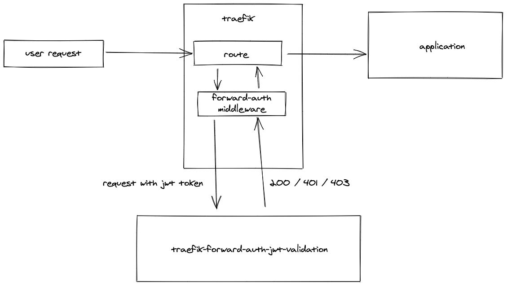
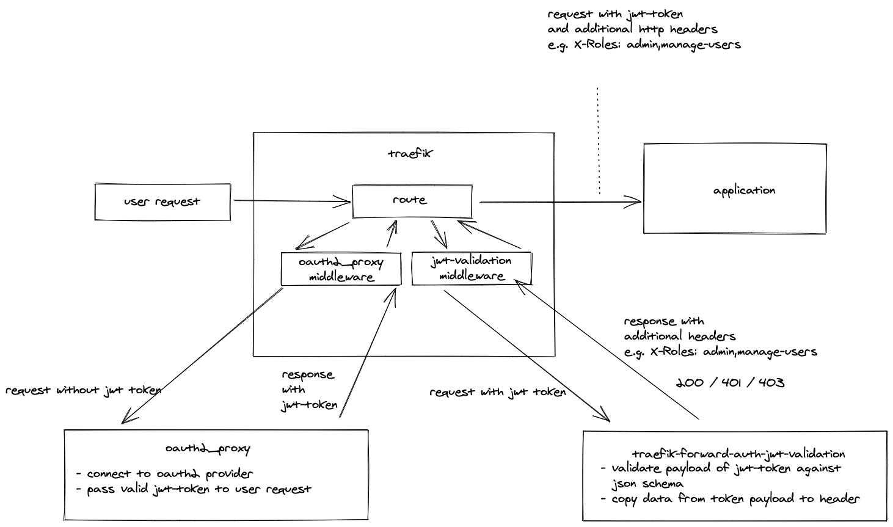
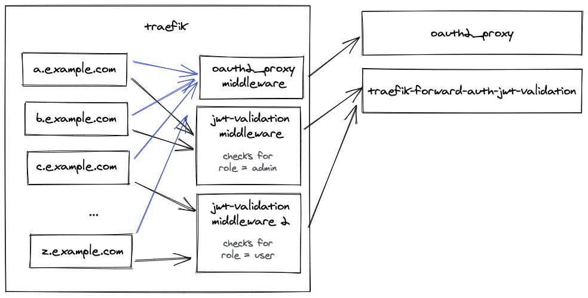

## traefik-forward-auth-jwt-validation

Validates a jwt token payload in http request header against a json-schema  

This project aims to work together with [oauth2_proxy](https://github.com/oauth2-proxy/oauth2-proxy)
but can also be used without it.

 


## Use Case

The use case is transparent authentication with multiple different authorization scenarios behind a sub domain.

Assume you have 20 services running behind *.example.com (a.example.com, b.example.com, etc...). 
None of these Services has Authentication or authorization methods. What we want to do is to 
keep them behind a transparent oauth2 authentication. For each service the user needs a specific
set of roles to access it. 

You cannot archive this scenario just with oauth2_proxy. Every different authorization scenario would
have to have a separate instance of oauth2_proxy running. That would also mean:
- Sign in for every authorazion scenario
- Huge resource waste for running multiple instances

So how do we solve this?

We put another forward-auth middleware behind the oauth2_proxy middleware That checks the jwt token against
a json schema. The configuration for the validation is passed in the URL of the middleware. 



With this done we archived 3 things. 

1. separated authentication and authorization
2. Declarative way to create new authorization layer without hosting a new container. We just need to create a new middleware
3. Pass information from the jwt token as a header to the the application so that the application doesn't have to worry about jwt
tokens

With that in mind we can create multiple different layers of authorization without wasting to many resources.



## Usage

### docker-compose example 
You can find a complete example in [examples/docker-compose.yml](examples/docker-compose.yml). 
This examples hosts a full test-suite for our use case on your local machine. 

- postgres
- keycloak (some manual steps necessary. see setup instructions in the docker-compose.yml) -> http://login.localhost.emcellsoft.de
- oauth2_proxy -> http://auth.localhost.emcellsoft.de
- traefik-forward-auth-jwt-validation
- demo whoami application -> http://whoami.localhost.emcellsoft.de

**Hint:** *.localhost.emcellsoft.de resolves to 127.0.0.1. You don't have to modify your /etc/hosts to test this

### Endpoints

The application doens't have any configuration anything that could be changed has to be passed as a query parameter in the middleware

#### /validate/jwt

validates the jwt payload in the http request headers against a given json schema. Also gives the possibility to extract
data from the jwt payload and pass it to the response headers.

##### Parameter `tokenHeader`

Specifies the header where the jwt token is placed.
If this parameter is not present we're searching in the following headers:
- Authorization: Bearer <jwt-token>
- X-Auth-Request-Access-Token: <jwt-token>


##### Parameter `jsonSchema`
jsonSchema which the jwt token will be validated against.
No validation will be performed if the parameter is ommited.

##### Parameter `extractAsHeader`
Extract data from the jwt token. Has to be in the following format
```
<http_response_header>|<jsonpath>
```
e.g.
```
X-Roles|$.realm_access.roles[*]
```
Copies the realm access roles to the X-Roles header

This is used to pass information of the jwt token to the
application behind the forward-auth. With this the application
doesn't have to know about jwt tokens. you can just pass user_id and
roles as a header to the application.

**Hint:** Can be given multiple times

##### Parameter `copyTokenToAuthorizationHeader`
Copies the JWT token to the Authorization Header
```
Authorization: Bearer <jwt_token>
```

I didn't get oauth2_proxy to pass the jwt token in the Authorization Header. This is useful if you 
have an application that is already looking at the Authorization header and you don't want to 
change the application.


#### /redirect

Sends a small html page that tries to redirect you to the given url. 
This is used to skip the "sign in with keycloak" button when you're not authorized.

##### Parameter `to` (required)

The user will be redirected to this url. Don't forget to URL-encode before adding.
 

## Installation

```bash
$ yarn install
```

## Running the app

```bash
# development
$ yarn run start

# watch mode
$ yarn start:dev

# production mode
$ yarn start:prod
```

## Test

```bash
# unit tests
$ yarn test

# test coverage
$ yarn test:cov
```

## FAQ

### Why jsonschema?

I've been searching for something to match a json object in a declarative way. 
Although I'm not really happy with it, I haven't found anything better than this.

### Why jsonpath

Same here as the reason for jsonschema. Have been searching for a declarative way

### With which tool have you created the Images. 

I'm Using [exalidraw](https://excalidraw.com/) on a daily basis. It has replaced the
whiteboard in my office. Really awesome application!

## License

traefik-forward-auth-jwt-validation [MIT licensed](LICENSE).
